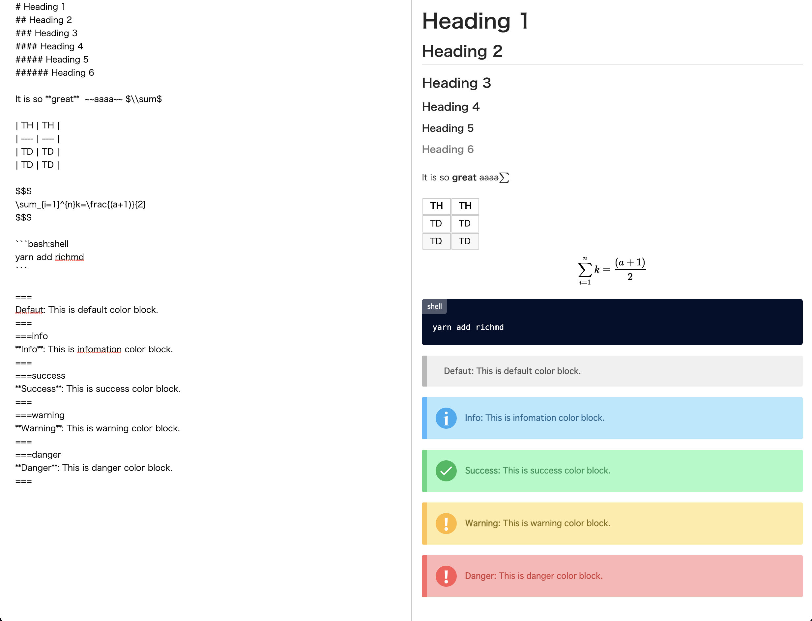

# Richmd v3
<!-- 

 -->

## What is Richmd?
Richmd is a tool for making Rich contents Markdown language.



## Usage
In general, installing `@richmd/core` is not necessary. For actual usage, we recommend using one of the following packages instead.

### JavaScript (TypeScript)
For more details, please see the README of [@richmd/js](https://github.com/richmd/js).

```sh
pnpm add @richmd/js
```

### React
For more details, please see the README of [@richmd/react](https://github.com/richmd/react).

```sh
pnpm add @richmd/react
```

### Vue
For more details, please see the README of [@richmd/vue](https://github.com/richmd/vue).

```sh
pnpm add @richmd/vue
```

## Methods
### `parseTree()`

You can retrieve Abstract Syntax Tree (AST) data using the `parseTree` method.
This is useful for customizing code generation on your own.

To use the parser standalone, you need to install `@richmd/core`.

```sh
$ pnpm add @richmd/core
```

#### Sample

```js
import { parseTree } from '@richmd/core';

const text = `# aaaa
## aaaaa

**aaaaaa**
`

const ast = parseTree(text);
```

### [Deprecated] `richmd()`
Using `richmd()` allows you to convert Markdown to HTML, but it is no longer recommended to import it directly from `@richmd/core`.
While there are currently no restrictions in place to support migration from v2, this method is expected to be removed in a future update.

If you need HTML conversion, please use an extension package such as `@richmd/js`.


## Markdown Syntax
Please read [Richmd Markdown Syntax Documentation](./docs/md-syntax.md).

### Supported Syntax
- strong
- italic
- image
- link
- headings
- horizontal rule
- blockquote
- unordeed list
- ordered list
- strikethrough
- code block
- checkbox list
- table
- TeX syntax (using [KaTeX](https://katex.org/))
- Color Inline Block
- Dropdown details
- Video(HTML5 Video Tag)
- Custom HTML Tag

## License
MIT

## Thank you :pray:
- [Markdown-tree-parser](https://github.com/ysugimoto/markdown-tree-parser)
  - Richmd's Markdown parser was created using the code in markdown-tree-parser as a reference.
- [KaTeX](https://github.com/KaTeX/KaTeX)
- [highlight.js](https://github.com/highlightjs/highlight.js/)
